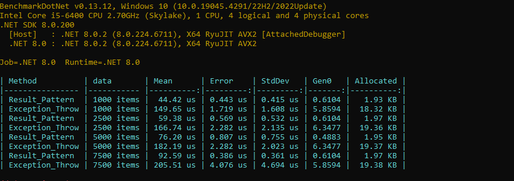

# C# Benchmarks
The primary aim of this repository is to benchmark common coding practices and patterns encountered in everyday C# development.

* [General Benchmarks](#general-benchmarks)
	* [Throwing Exceptions vs Result Pattern](#measure-one---throwing-exceptions-vs-result-pattern)
* [Reflection Benchmarks](#reflection-benchmarks)
	* [Get Enum Value Attribute](#get-Enum-value-attribute)
	* [Export Data by Reflection](#export-data-by-reflection)
	* [Create Instance of Class](#create-instance-of-class) 

### Get Started
Go to either the General Benchmarks or Reflection Benchmarks project and uncomment the benchmark you want to run in the program.cs file. Then, start the console app with the selected project and **Release** configuration..


## General Benchmarks

* [Throwing Exceptions vs Result Pattern](#measure-one---throwing-exceptions-vs-result-pattern)


## Throwing Exceptions vs Result Pattern
In the realm of error handling and control flow in C# programming, developers often encounter the choice between two primary approaches: Throwing Exceptions and employing the Result Pattern. The Throwing Exceptions method relies on the standard exception mechanism to handle error conditions, while the Result Pattern entails returning a structured result object containing both the result of the operation and any potential error information. This benchmark measure aims to compare the performance of these two approaches.



## Reflection Benchmarks
Reflection is a very powerful tool for determining objects during run-time, but it takes performance. There is a widely held opinion throughout the community that reflection is bad and should not be used, yes it is slow, but is it realy problem? Except high performance applications we should always decide for solution which is simple, clean and easy to test and in some specific cases reflection is the solution. Also reflection give us power to write our piece of code generic, so we can reuse it.

* [Get Enum Value Attribute](#get-Enum-value-attribute)
* [Export Data by Reflection](#export-data-by-reflection)
* [Create Instance of Class](#create-instance-of-class)

## Get Enum Value Attribute
Sometimes, we require human-readable explanations for enum values, and one of the simplest solutions is to use attributes. Reflection provides a convenient way to extract attributes from enum values. In this benchmark measure, we observe the performance of a generic method extension that retrieves custom attributes from enum values.

```C#
    public static class EnumExtensions
    {
        public static T GetCustomAttribute<T>(this Enum customEnumValue) where T : Attribute
        {
            return customEnumValue
                .GetType()
                .GetMember(customEnumValue.ToString())
                .First()
                .GetCustomAttribute<T>()!;
        }
    }
```

Benchmark shows result of three enums with different sizes and also GetCustomAttribute reflection method which is called in for loop.
* **CustomLargeEnum** with 35 values 
* **CustomEnum** with 16 values
* **CustomSmallEnum** with 6 values

To be able to compare with some fast solution I create static Dictionary -> Map with CustomEnum as key and string as value which represents description.

```C#
    public static class CustomEnumMap
    {
        public static readonly IDictionary<CustomEnum, string> Map = new Dictionary<CustomEnum, string>()
        {
			...
        };
    }
```


#### Summary
Comparatively, the implementation with Dictionary shows significantly faster performance and avoids memory allocation when retrieving values by key. However, it requires manual editing every time a new item is added to the Enum.
On the other hand, Reflection is slower and leads to memory allocation, resulting in frequent garbage collections and increased memory usage, especially evident with a large number of items such as 25k. Despite this, Reflection eliminates the need for Enum editing.

In scenarios with a high volume of method calls, Reflection may prove inadequate. However, for fewer calls, up to a hundred, it remains viable, particularly considering the generic nature of our code.


## Export Data by Reflection
Exporting data to .csv, .xlsx, and .ods file formats is standard in many business applications. In this scenario, we utilize reflection within a generic export method, leveraging custom attributes that represent headers.

Benchmar show results of three classes with different sizes which are exported to csv file.
* **CustomLargeItem** with 32 properties 
* **CustomItem** with 16 properties
* **CustomSmallItem** with 7 properties

Implementation of our generic csv export is in GenericCsvExport.GenericCsvExport extension method. To be able to compare the generic export I created extension methods for every class which has headers prepared in collection (CsvItemExport, CvLargeItemExport, CsvSmallItemExport).


#### Summary
The results indicate that the faster method performs nearly twice as fast and allocates almost half the memory. However, it's crucial to note that the execution time is measured in microseconds. Despite the apparent speed advantage of the faster method, reflection still stands out as the superior solution.

Reflection offers the advantage of dynamic and flexible behavior, making it more adaptable to changes and future enhancements. While the performance difference might seem significant in microsecond terms, the broader considerations of code maintainability and scalability often favor the versatility of reflection. Therefore, despite its slower performance in this specific benchmark, reflection remains the preferred choice for its long-term benefits.

## Create Instance of Class
Even if we use IoC container which holds instance of our class, sometimes we need to create new instance of the class, typically with different parameters dedicated for specific scope. In that case we can use reflection.

Benchmark show results of three methods:
* CreateInstance - create instance using already builded ServiceProvider (fastest and preferable solution)
* ActivatorCreateInstance_Interface - create instance of class by interface. We need to find interace implementation so we use GetTypeByInterfaceSingle extension method which search through assembly types
* ActivatorCreateInstance_Concrete - create instance of class by class type.


#### Summary
The Activator.CreateInstance_Concrete method proves to be sufficiently fast when compared to CreateInstance, but it requires specifying a concrete class. On the other hand, Activator.CreateInstance_Interface is more than 10 times slower than Activator.CreateInstance_Concrete, yet it offers the advantage of being generic. This means it doesn't necessitate editing the method each time we change the implementation of an interface.

Creating instances via the ServiceProvider is consistently the preferred and cleanest solution, as it's initiated at a defined starting point of the application or request. However, in specific cases where instance creation is required at runtime, the choice between Activator.CreateInstance_Concrete and Activator.CreateInstance_Interface depends on various factors, each with its own set of advantages and drawbacks.
