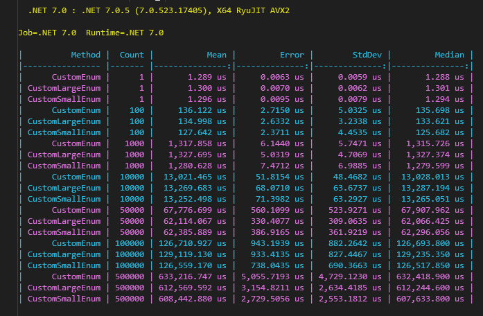

# IN PROGRESS

# ReflectionBenchmar
Reflection is a very powerful tool for determining objects during run-time, but it takes performance. There is a widely held opinion throughout the community that reflection is bad and should not be used, yes it is slow, but is it realy problem? Except high performance applications we should always decide for solution which is simple, clean and easy to test and in some specific cases reflection is the solution. Also reflection give us power to write our piece of code generic, so we can reuse it.

# Menu

* [Motivation](#motivation)
* [Get Started](#get-started)

# Motivation

I was curious how fast are some of my daily basis extension methods which use reflection.

# Get Started
Simply Start console app with **Release** configuration.

# Measure One - Get Enum Value Attribute
Sometimes we need human explanation of enum values and one of the simplest solution is to use attribute. Reflection is nice way to extract attribut from enum value, so in this benchmark measure we can see results of extensions generic method which gets custom attribute from enum value.

```C#
    public static class EnumExtensions
    {
        public static T GetCustomAttribute<T>(this Enum customEnumValue) where T : Attribute
        {
            return customEnumValue
                .GetType()
                .GetMember(customEnumValue.ToString())
                .First()
                .GetCustomAttribute<T>()!;
        }
    }
```

Benchmark shows result of three enums with different sizes and also GetCustomAttribute reflection method which is called in for loop.
* **CustomLargeEnum** with 35 values 
* **CustomEnum** with 16 values
* **CustomSmallEnum** with 6 values

To be able to compare with some fast solution I create static Dictionary -> Map with CustomEnum as key and string as value which represents description.

```C#
    public static class CustomEnumMap
    {
        public static readonly IDictionary<CustomEnum, string> Map = new Dictionary<CustomEnum, string>()
        {
			...
        };
    }
```



### Summary
As we can see implementation with **Dictionary** is much faster and do not allocate memory when we try to get value by key, but it has to be edited every time we add a new item to Enum.
**Reflection** is slower and allocate memory in consequence of which runs GC. In the case of 25k items it is a lot of garbage collections and allocated memory. On the other hand with relfection we don't care about Enum editing.

**In this case reflection is insufficient for bunch of method calls, but till hundred of calls it seems totally OK and also our code is generic.**


# Measure Two - Export Data by Reflection
Export to .csv, .xlsx, .ods file formats is standard for a lot of business applications. In this case we can use reflection in generic export method with custom attribute which representing header.

Benchmar show results of three classes with different sizes which are exported to csv file.
* **CustomLargeItem** with 32 properties 
* **CustomItem** with 16 properties
* **CustomSmallItem** with 7 properties

Implementation of our generic csv export is in GenericCsvExport.GenericCsvExport extension method. To be able to compare the generic export I created extension methods for every class which has headers prepared in collection (CsvItemExport, CvLargeItemExport, CsvSmallItemExport).


### Summary
The results show us that faster method is almost twice faster and alocates almost twice less memory, but let's not forget that execution time is in microseconds. Although the faster method is twice "better" I think that reflection is still the right solution.

**By the results of this case, I am definitely for reflection usage. The reflection method is generic, clean and sufficient.**

# Measure Three - Create Instance of Class
Even if we use IoC container which holds instance of our class, sometimes we need to create new instance of the class, typically with different parameters dedicated for specific scope. In that case we can use reflection.
